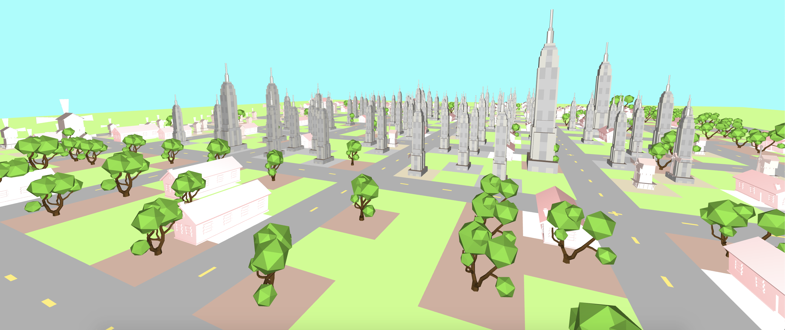

# HistoryCity

History City is a browser history visualizer that creates a city in realtime based on the type and frequency of sites you visit.



## Set Up

You will need to have a JSON copy of your history saved onto your computer. You can use the [Export History](https://chrome.google.com/webstore/detail/export-history/hcohnnbbiggngobheobhdipbgmcbelhh) extension in Chrome to download your history. 

Save the file under the name chrome_history.json in the data/ directory.

## Installation

Install all necessary dependencies in data/requirements.txt.

Run the following script

```bash
python3 data/history_parser.py
```

This script will organize your urls into different categories based on url link and source content. When a url is not detected, the program will prompt you to enter what you believe is the best object representation for the site.

On line 12 on history_parser.py, you can toggle the setting below to prevent asking the user.

```python
# Activating this will allow for users to specify unknown website types.
ASK_FOR_USER_INPUT = True
```

## Running the Program

Run a localhost in the root directory.

```bash
python3 -m http.server
```

Using a browser, type in 'localhost:8000’ to view your HistoryCity come to life. The baseline code ships with just one url and one building, so be sure to add in your own history!
